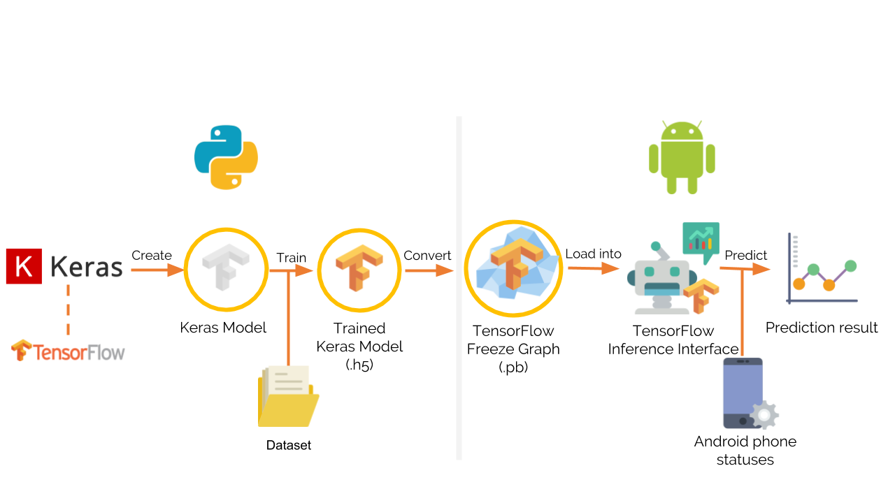
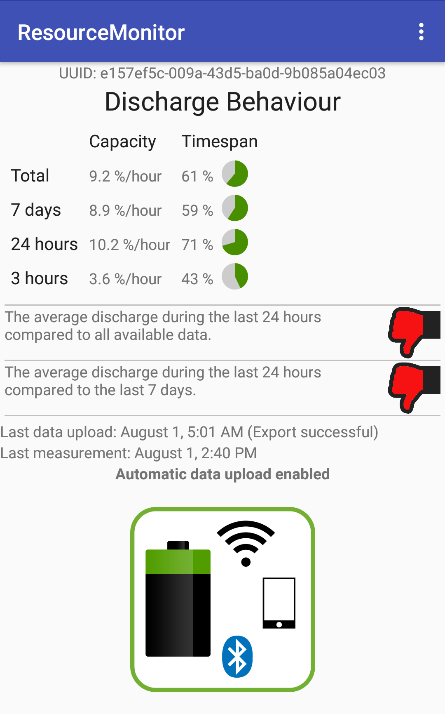
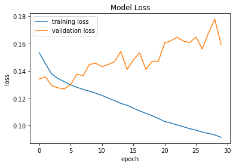
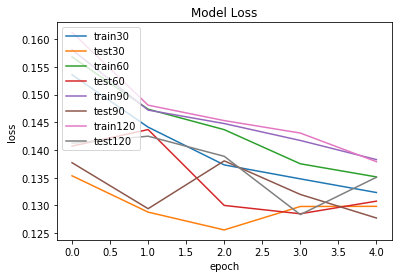

# Android Phone Resources Usage Pattern Prediction Using TensorFlow

This project is trying to evaluate the feasibility of using TensorFlow to analyze mobile phone status records data to predict the future usage of the phone resources per user basis, which could be helpful in optimizing the background services resources usage, especially for WiFi and Bluetooth modules. The mobile phone usage behavior varies for each users, and the resources being used are not the same, so in order to predict that, TensorFlow is used to create a machine learning model and deploy on mobile phones to make inferences on the future resources usage statuses.

In this project, Keras, a high-level neural network API with TensorFlow backend is used on Python to create a machine learning model. The model is then trained with an Android phone status records dataset. After that, the trained model is loaded into an Android application for inferencing. The application would then gathers the status data of the Android phone and feed into the Inference Interface with the model to get the prediction result.

*Figure 1. Diagram Showing an Overview of Project Workflow*

## Methodology

### Preparing Data

The original dataset is the records of an Android phone status collected using ResouceMonitor application (https://github.com/ComNets-Bremen/ResourceMonitor). The application monitors the changing of states of different modules in Android phone and records the data every time the changes occurs. The data can then be exported as a JSON file. Data conversion is done to turn the data into a TensorFlow usable format such as CSV that contains the values of all the attributes and target in each row.

*Figure 2. Screenshot from ResourceMonitor application*

The data can be viewed as a time series, and the timesteps between each row should be equal to make a good analysis of it. As the gaps between each row are not consistent in the dataset, so we need to transform it to have equal timesteps. The transformation is done by creating an empty table with one-minute timestep and merge with the original data, and interpolating the intermediate timesteps to get an equally-spaced time series, and in addition, minute of the day, date, and day of the week are added as new attributes.

*Figure 3. Example rows from the dataset*

### Creating a TensorFlow model
In order to create a machine learning model for time series predictions, Keras with TensorFlow backend is used on Python to perform the operation. The model is created as a neural network with one input LSTM (Long short-term memory) layer, one hidden LSTM layer, and one output dense layer. After the model is created, a dataset from the record of 90 days (129,600 rows) was loaded and split into 72 days training set for the model training (80%), and 18 days testing set for the model validation (20%). The number of training epochs was fine-tuned by plotting the mean squared error loss within the training set for each number of epochs. The result shows that 5 epochs is an appropriate number as the validation loss starts to increase significantly after that point, which signifies the overfitting, a situation when the model conforms too tightly to the variation in the training data, causing it to lose prediction power.

*Figure 4. Graph of the mean squared error loss for each number of epochs*

After having a suitable number of epochs, different batch sizes are trained and validated within the training set to determine the best batch size. The result shows that at epoch 5, the model with batch size = 90 has the lowest validation loss, so that number of batch size is chosen for training.

*Figure 5. Graph of the mean squared error loss of the models with different batch sizes*

### Implementing the inference interface on Android

To make inferences on Android, an application is implemented to collect the Android phone statuses and use those values as the inputs to the trained model and make predictions. The result would be the prediction of the WiFi status of the user’s Android phone 30 minutes in the future. As the prediction values are floating point values according to the confidence of the prediction, they are rounded to the nearest integer values as either 0 or 1, which signify the on and off statuses of the WiFI module. The application also shows the predictions compared to the actual values as a graph and a confusion matrix.

*Figure 6. Example screenshot from the Android application implemented*

## Authors
* **Weerawat Pawanawiwat** - [ErbaZZ](https://github.com/ErbaZZ)
* **Vorameth Reantongcome** - [MrWhiteC](https://github.com/MrWhiteC)
* **Advisors: Jens Dede, Prof. Dr. Anna Förster**